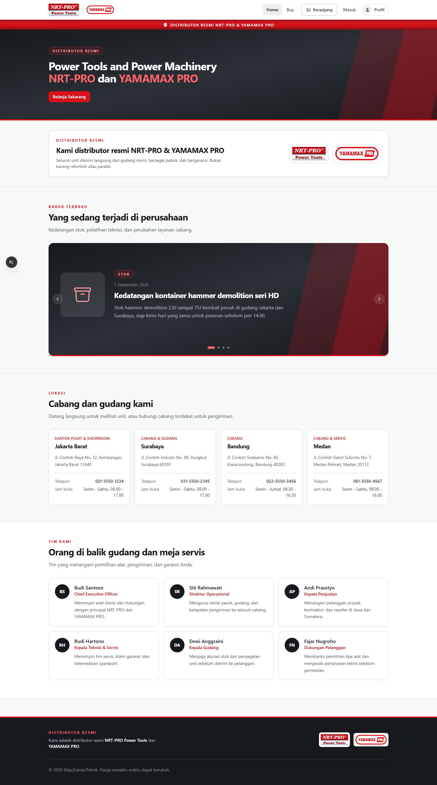
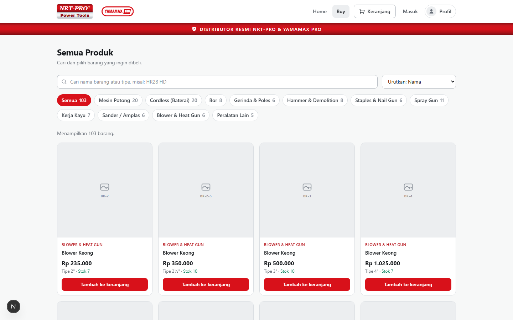
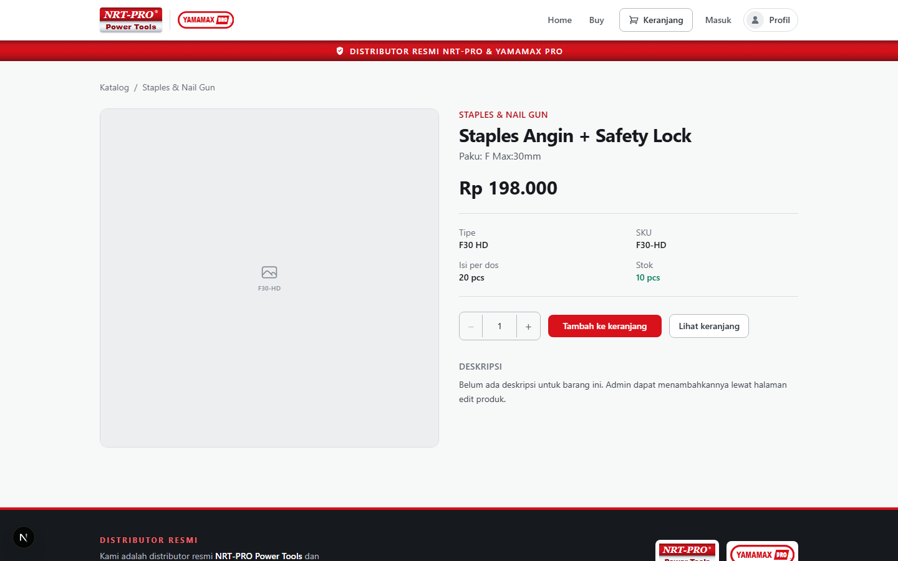
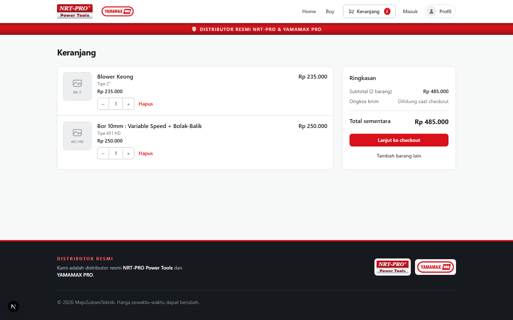
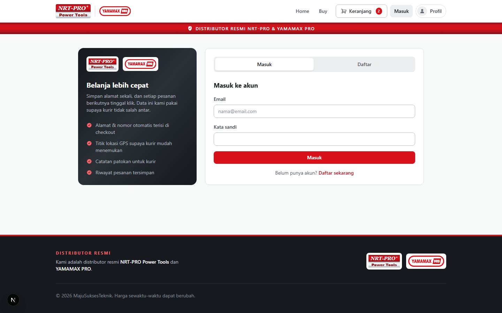
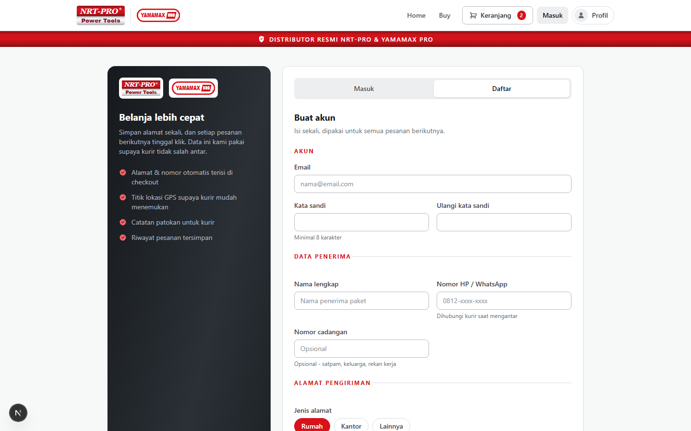
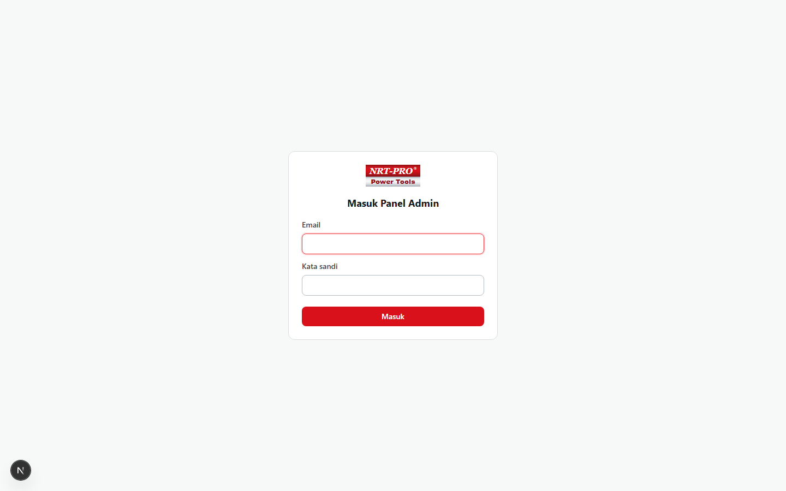
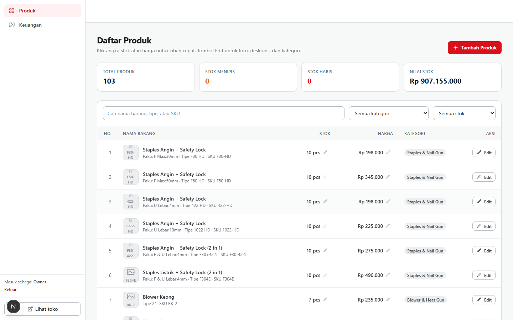
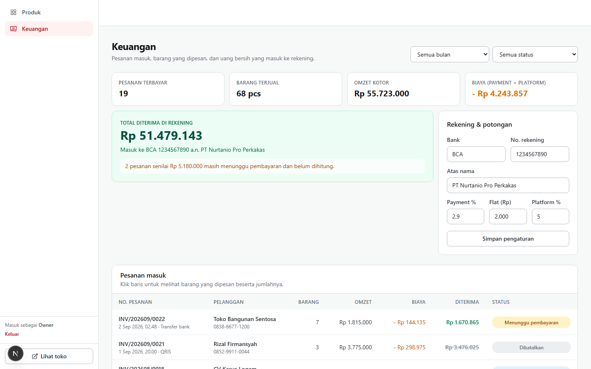
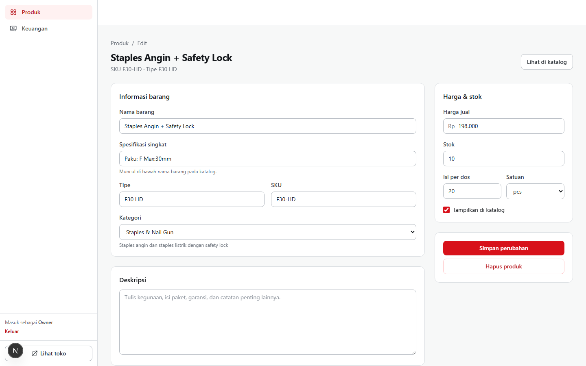

# NRT-PRO Shop

An e-commerce storefront and back-office admin panel for **MajuSuksesTeknik**, an official
distributor of **NRT-PRO Power Tools** and **YAMAMAX PRO** in Indonesia. Buyers browse a
103-item catalogue across 11 tool categories, add to cart, and check out; store staff manage
stock, prices, and incoming orders from a separate admin panel.

Built with Next.js (App Router) + TypeScript + Tailwind on the frontend, with Supabase
(PostgreSQL + PostgREST) as the database, accessed exclusively through this app's own
Route Handlers — there is no separate backend service to run.

## Screenshots

### Storefront

**Home** — hero, official-distributor panel, a "what's new" carousel, branch locations, and team.



**Catalogue** — search, category filters, sort by price, live stock per item.



**Product detail**



**Cart**



**Sign in / register** — buyers can save a delivery address (with a map picker and cascading
Indonesian province/city/district/postal-code selects) so checkout is a one-click affair
afterwards.




### Admin panel

Hidden behind its own login — visiting any `/admin/*` page while signed out renders an
ordinary-looking 404 rather than a redirect, so the panel's existence isn't discoverable from
the URL alone.



**Product list** — inline "quick edit" for stock and price (click the number, `Enter` to save,
`Esc` to cancel), full CRUD via the Edit page.



**Finance** — incoming orders, revenue, and the payment/marketplace fee breakdown that
determines what actually lands in the bank account; bank details and fee percentages are
editable from the same page.



**Edit product**



## Tech stack

- **Next.js 15** (App Router) + **React 19** + **TypeScript**, Tailwind v4 for styling
- **Supabase** (PostgreSQL, accessed via `@supabase/supabase-js` and PostgREST) — no ORM
- **Leaflet** + OpenStreetMap Nominatim for the delivery-address map picker
- [wilayah.id](https://wilayah.id) + [kodepos.vercel.app](https://kodepos.vercel.app) for
  cascading Indonesian province/city/district/postal-code selects
- Zero external auth provider — accounts, sessions, and password hashing are hand-rolled on
  top of Postgres (see [Auth & security](#auth--security) below)

## Getting started

```bash
npm install
cp .env.example .env.local   # then fill in the Supabase values, see below
npm run dev                  # http://localhost:3000
```

### 1. Create a Supabase project

Create a project at [supabase.com](https://supabase.com), then run every file in
`supabase/migrations/` **in order** against it (SQL Editor → paste → Run), followed by
`supabase/seed/0001_seed_catalog.sql` to load the 103-product catalogue:

| Migration | Adds |
| --- | --- |
| `0001_categories_and_products.sql` | `categories`, `products` — public read via RLS, writes only via `service_role` |
| `0002_customers_and_admins.sql` | `customers`, `customer_addresses`, `customer_sessions`, `admin_users`, `admin_sessions` — RLS on, **no** policies (fully locked to `service_role`); seeds one owner admin account |
| `0003_admin_login_and_stock.sql` | `verify_admin_login()` and `decrement_product_stock()` Postgres functions |
| `0004_customer_login.sql` | `hash_password()` and `verify_customer_login()` Postgres functions |

Password verification happens **inside Postgres** (via `pgcrypto`'s `crypt()`), and every one
of these functions has `EXECUTE` revoked from `anon`/`authenticated` and granted only to
`service_role` — the anon key genuinely cannot read a password hash or log in as anyone, even
if it leaked.

### 2. Environment variables

```bash
# .env.local — see .env.example
NEXT_PUBLIC_SUPABASE_URL=https://xxxxx.supabase.co
NEXT_PUBLIC_SUPABASE_ANON_KEY=sb_publishable_xxx      # Project Settings > API Keys
SUPABASE_SERVICE_ROLE_KEY=sb_secret_xxx                # same page, "Secret keys" — server-only, never commit
```

The service role key is read only by server-side code (`src/lib/supabase.ts`, imported by
Route Handlers and `src/middleware.ts`) — it is never bundled into client JavaScript.

### 3. Log in as admin

Migration `0002` seeds one owner admin account (`edriceson@gmail.com`). Set your own password
for it via SQL — there is no admin "change password" UI yet:

```sql
update admin_users
set password_hash = crypt('your-new-password', gen_salt('bf', 12))
where email = 'edriceson@gmail.com';
```

Then go to `/admin/login` directly (there is no link to it anywhere on the site — see
[Auth & security](#auth--security)) and sign in with that email and password.

## Routes

| Route | What's there |
| --- | --- |
| `/` | Home: hero, distributor panel, news carousel, locations, team |
| `/buy` | Catalogue: search, category filter, sort, add to cart |
| `/product/[slug]` | Product detail |
| `/cart` | Cart |
| `/checkout` | Delivery details, shipping method, payment method |
| `/order/[id]` | Order confirmation |
| `/masuk` | Sign in / register |
| `/profile` | Delivery address, password change, order history |
| `/admin/login` | Admin sign in (not linked from anywhere else) |
| `/admin/products` | Product list with quick-edit stock/price |
| `/admin/products/new`, `/admin/products/[id]` | Create / edit / delete a product |
| `/admin/finance` | Orders, revenue, fee breakdown, bank settings |

## Data layer

`src/lib/api.ts` is the **only** file in the app that knows where data comes from — every
page and component calls functions from here, never `fetch()` or Supabase directly.

- **Products** (`src/lib/db/products.ts`) and **customer accounts**
  (`src/lib/db/customers.ts`) are fully wired to Supabase, through this app's own Route
  Handlers under `src/app/api/*` (thin — auth check, then call the db layer).
- **Orders and settings** have no Supabase table yet, so they still read/write a localStorage
  mock (`src/lib/mock-db.ts`), seeded from `src/data/`. This is a known, intentional gap: the
  checkout flow still creates an order client-side and calls a real
  `decrement_product_stock()` RPC per line item to keep stock accurate, but the order record
  itself isn't durable server-side yet.

Money is always an integer number of rupiah — never a float — both in the database (`bigint`)
and in application code, so nothing can drift from rounding.

## Auth & security

Two independent, hand-rolled session systems (no `auth.users`, no third-party auth provider):

- **Customers** — `customers` / `customer_addresses` / `customer_sessions`. Registering
  creates an account plus one default delivery address; signing in issues an httpOnly session
  cookie (30-day expiry). Changing a password revokes every *other* session for that account.
- **Admins** — `admin_users` / `admin_sessions`, gated by `src/middleware.ts` on every
  `/admin/*` request. An unauthenticated request doesn't get redirected to `/admin/login` — it
  gets rewritten to an ordinary 404, indistinguishable from a typo'd URL, so the panel's
  existence isn't discoverable by probing paths.

Both login routes are rate-limited per-IP and per-email (`src/lib/rate-limit.ts`), and
passwords are checked server-side against a minimum-length policy
(`src/lib/password-policy.ts`) regardless of what the browser form already enforces, since
anyone can POST to the API directly.

## Money calculation (admin finance page)

```
gross         = product subtotal + shipping paid by the buyer
paymentFee    = gross × paymentFeePercent + paymentFeeFlat   (0 for COD)
marketplaceFee = product subtotal × marketplaceFeePercent    (shipping is not cut)
netToBank     = gross − paymentFee − marketplaceFee
```

Percentages and the bank account are editable from the "Rekening & potongan" card on
`/admin/finance`. Orders still `menunggu_pembayaran` (awaiting payment) are shown separately
as not-yet-received; `dibatalkan` (cancelled) orders are excluded entirely.

## Scripts

```bash
npm run dev        # start the dev server
npm run build       # production build
npm run start        # run the production build
npm run typecheck   # tsc --noEmit
npm run lint         # next lint
```
